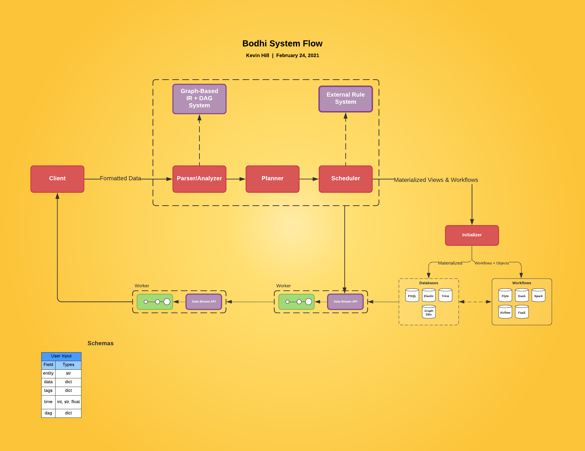

<br />

<div align="center">
    <h1>Bodhi Feature Store</h1>
    <p><h3 align="center">Feature Store Converting Object Oriented Code to Distributed Stateful Dataflows</h3></p>
    <div align="center">
    </div>
</div>

<hr>

Bodhi Feature Store is a multi-part framework which compiles object oriented Python code to distributed stateful dataflows and features you can manipulate within your database. 


These dataflows get converted to different target systems, including SQL (materialized views and triggers), processing systems (such as AWS lambda, etc), and more. 


## Features

- Analysis and transformation of Python classes to distributed stateful dataflows. These dataflows can be ported to cloud services and dataflow systems.
- Due to the nature of dataflow systems, stateful entities cannot directly interact with each other. Therefore, direct calls to other objects, as done in object-oriented code, does not work in stateful dataflows. StateFlow splits such functions at the AST level to get rid of the remote call.
  Instead, StateFlow splits a function into several parts such that the dataflow system can move back and forth between the different stateful entities (e.g. dataflow operators).

The full system is comprised of a client and a backend server. The backend server runs takes a compiled AST extracted from the client library and converts it to a dataflow system. The client library is a Python library which can be used to compile and run dataflow systems. It does this by analyzing the AST and converting it into a intermediate representation that the back-end responds to.


The dataflow itself is stored inside of a graph database for easy review, manipulation, sharing, and accessing.

## Installation

TBA ... These instructuions are sparse for the time being. Will update over time.


```bash
docker-compose up
```


## System Design

Here's the full system design of the Bodhi Feature Store.




## Why Not Write Another Programming Language?

The world doesn't need too many new absolutely discrete languages. Python is already a very popular language, so is SQL. Prorcessing framework wise, we already have lambda and many other processing systems. What we need are ways to better manage the interopability of these systems without having to compromise by having to learn an entirely new language.

The upside to using an IR is that we can easily convert the dataflow system to other systems, and expand on those systems dynamically. For example, we can convert simple dataflow logic that doesn't rely on outside code to a SQL code. By using triggers we can reduce the amount of movement of teh data itself.


